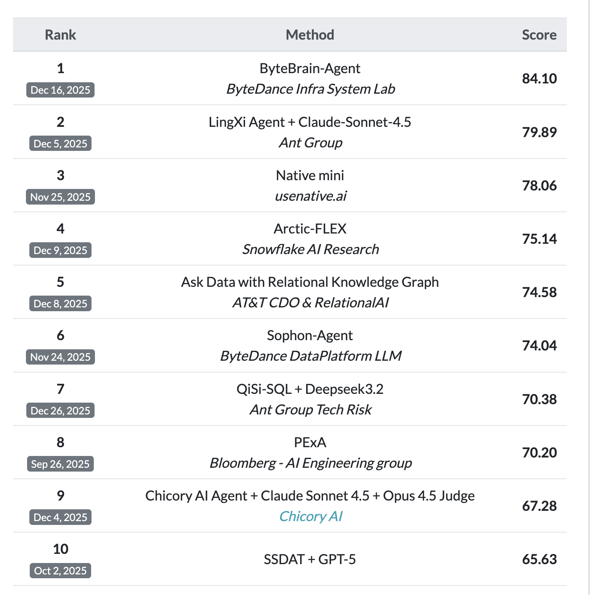

# QiSi-SQL

## Overview

Qisi-SQL is an enterprise-grade Text-to-SQL system designed to convert natural language questions into accurate and executable SQL queries. It integrates advanced capabilities such as data preprocessing, table retrieval, document retrieval, and context compression to handle complex database querying tasks in real-world scenarios.

📢 **Note**: The full technical report and core implementation will be open-sourced in the coming months.

## Evaluation

🎉 Qisi-SQL achieves **7th place**(Dec 26, 2025) on the competitive benchmark [Spider2-snow](https://spider2-sql.github.io/), which consists of diverse and challenging cross-domain text-to-SQL tasks. Detailed evaluation results and analysis are available in the `evaluation/` directory.

## Key Features

- **Multi-Stage Pipeline**: Incorporates data preprocessing, schema linking, SQL generation, and execution verification
- **Intelligent Retrieval**: Employs table retrieval and document retrieval to enhance context awareness
- **Context Compression**: Reduces noise and focuses on relevant database schema information
- **Enterprise Readiness**: Built for robustness, scalability, and deployment in production environments
- **Cross-Database Support**: Compatible with multiple SQL dialects and database management systems

## Core Components

| Component | Description |
|-----------|-------------|
| **Data Preprocessor** | Cleans and normalizes input questions, schema, and historical context |
| **Table Retriever** | Identifies and ranks relevant database tables for a given query |
| **Document Retriever** | Retrieves supplementary documentation or examples to aid SQL generation |
| **Context Compressor** | Filters and condenses schema information to improve model focus |
| **SQL Generator** | Translates natural language and schema into syntactically correct SQL |
| **Execution Verifier** | Validates SQL queries against the database for logical correctness |

## Use Cases

- **Business Intelligence**: Enable non-technical users to query databases using natural language
- **Data Analytics Automation**: Accelerate data exploration and report generation
- **Database Tooling Integration**: Embed Text-to-SQL capabilities into existing data platforms
- **Enterprise Data Governance**: Provide controlled and auditable natural language data access
- **Developer Productivity**: Reduce time spent writing and debugging SQL queries

## Getting Started

Detailed setup instructions, API documentation, and usage examples will be provided upon the open-source release.

## Citation

Citation information will be included with the release of the technical paper.

## Stay Updated

The research paper and source code will be open-sourced in the early months. Follow this repository for updates!
